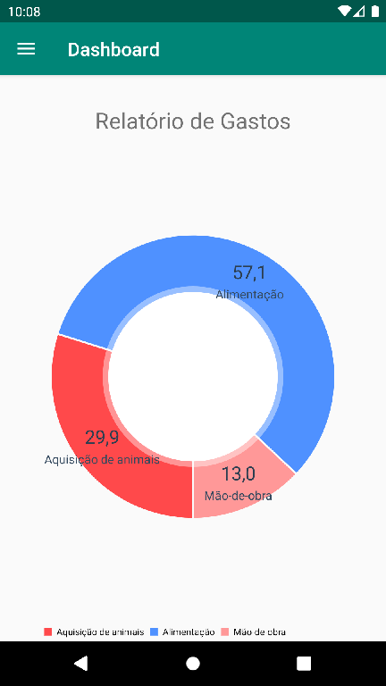
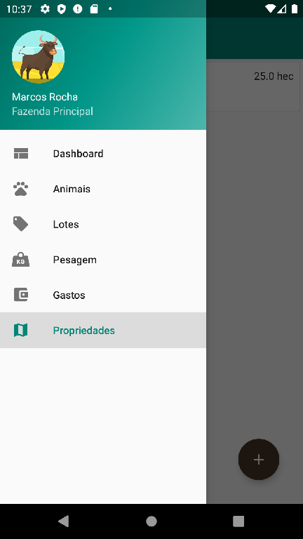
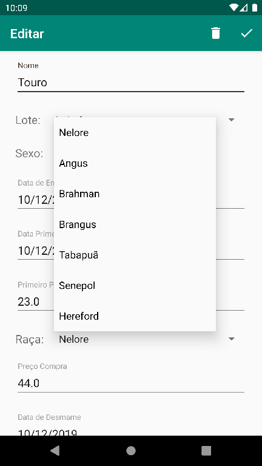
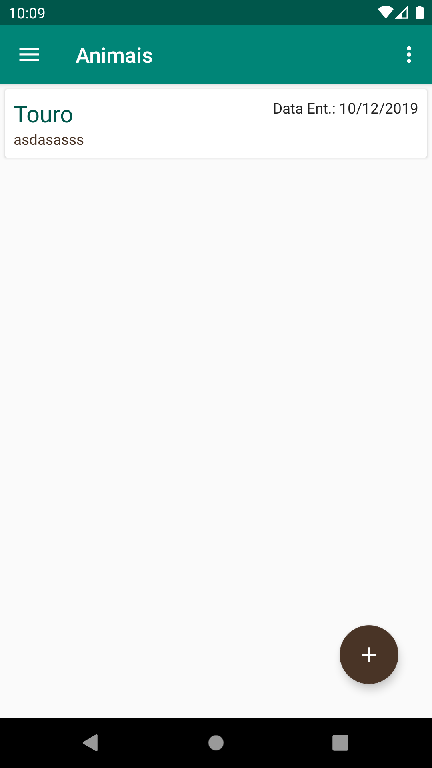
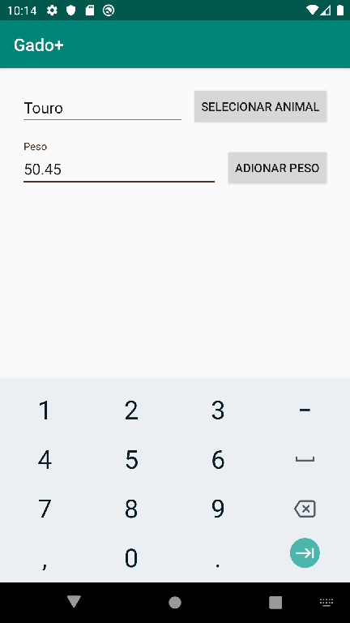

# Gado Plus

Sistema de controle  que facilita a gestão de propriedade, gastos e pesagem de gado de corte para pequenos produtores rurais.

## Pré-requisitos

- Android Studio 3.5.3
- Room 2.2.0
- MPAndroidChart 3.1.0

## Aplicativo

## Autor

* **Marcos Rocha** 

Veja também a lista de contribuidores(https://github.com/dev-marcos/Gado-Plus/contributors) que participaram deste projeto.

## Licença

Este projeto está licenciado sob a licença MIT - consulte o arquivo [LICENSE.md] (LICENSE.md) para obter detalhes

